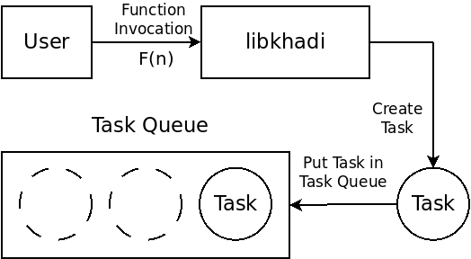
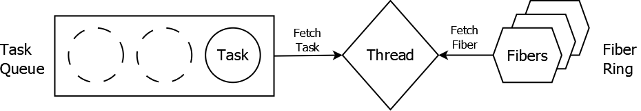
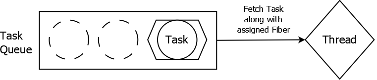
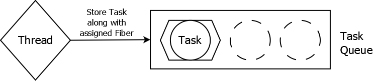
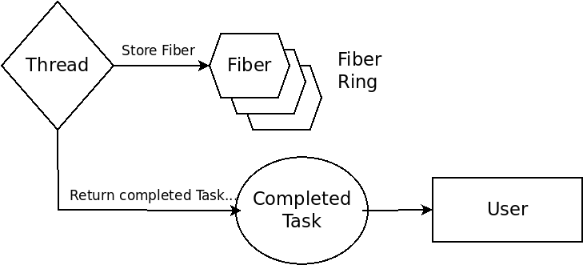

# libkhadi
Hand-woven Library for Fiber-based Job Systems 

`libkhadi` implements a multi-threaded Job System that uses Fiber to implement cooperative multithreading in user-space. It can be used where one needs low-overhead synchronization, control over context-switching, or to "job-ify" existing codebase.

This library was inspired by by Christian Gyrling's 2015 GDC presentation [Parallelizing the Naughty Dog Engine Using Fibers](http://www.gdcvault.com/play/1022186/Parallelizing-the-Naughty-Dog-Engine).

## Background

### Fibers

A fiber is a light-weight thread of execution that consist of a callstack and registers
context. Creating a fiber is a very lightweight process, which only requires
allocating some memory for the stack and the register context. When a fiber is scheduled off,
the current register context is saved in its memory space; to schedule a fiber for execution,
the register context is restored and the stack pointer register is switched to
the stack provided by the fiber. Fibers are also scheduled non-preemptively, meaning that
an explicit `yield()` operation is required to give control back to the scheduler. In `libkhadi`,
the fibers are kept in a global multi-threaded ring data structure.

### Task 

The unit of computation that executed on the Fibers is called a Task. It is a record
type (`struct` in C) that comprises of a function pointer and a point to the argument
that the function takes. Each fiber comes with a small launching code that reads the
task which has been assigned to it, and then calls the given function with the given argument.
The tasks are stored in a global multi-threaded unbounded queue. 

## Working

### Scheduling

Firt, we creates a Task whose function pointer points to the the function we want to execute, while the data
pointer contains the address of the arguement. This Task is inserted into the global Task Queue,
from where the scheduler can pick it up and execute it to completion.

    \caption{The worker thread dequeues a suspended Task, and uses the already assigned Fiber to run it.}
    \label{fig:image_resume}
\end{figure}

Each thread runs a scheduler function which works like this: At the beginning
of each scheduling cycle, the scheduler dequeues a task and checks whether it has a Fiber attached to it.
If a Fiber is found, the execution is switched to it through the stack-switching mechanism described
above; on the other hand, if no Fiber is assigned to the Task, an unused Fiber is fetched from the
global ring and is assigned to this task. This assignment includes storing the Fiber's pointer 
in the Task's metadata, as well as storing the function and data pointers belonging
to the Task in the Fiber's private memory. Finally, the Fiber is scheduled on using the stack switching
mechanism described above.

When the Fiber yields, the control is returned back to the scheduler. Here, the scheduler
first checks if the task has been finished, i.e., if the Task function ran to completion.
If so, the Fiber is set back to unassigned and the Fiber is put back into the ring. Otherwise, the Task along with the Fiber that is assigned to it is put in the Task Queue.

### Synchronization

